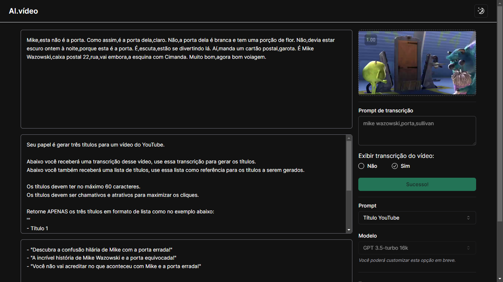
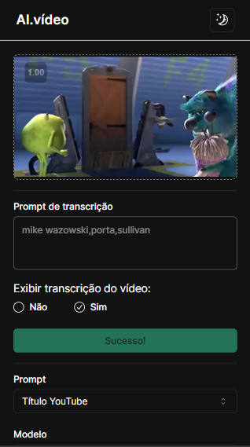
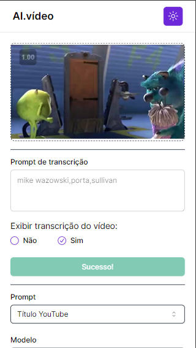
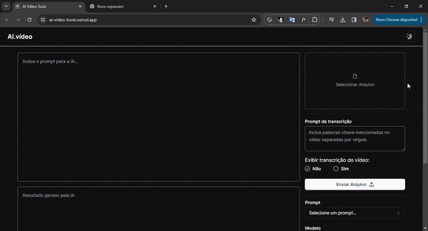

## 📌 Sobre

**AI-Video-Tools** é uma avançada ferramenta que emprega inteligência artificial (IA) para simplificar a criação de títulos e descrições para vídeos do YouTube, com base na transcrição do conteúdo. Além disso, esta ferramenta oferece a capacidade de gerar diversos tipos de conteúdos, tudo isso com a simples modificação do prompt inicial.

## 🚀 Tecnologias utilizadas

O projeto foi desenvolvido utilizando as seguintes tecnologias:

- [Nextjs](https://nextjs.org/)
- [Tailwindcss](https://tailwindcss.com/)
- [Typescript](https://www.typescriptlang.org/)
- [ffmpeg](https://ffmpegwasm.netlify.app/)
- [Radix-ui](https://www.radix-ui.com/)
- [Shadcn/ui](https://ui.shadcn.com/)

## ✏ Para iniciar o projeto basta utilizar os seguintes comandos

- Clonar o repositório

    <pre><code>git clone https://github.com/CaioMMendes/NLW-AI</code></pre>

- Abrir a pasta no VsCode
- Adicionar um arquivo .env no servidor contendo NEXT_PUBLIC_BASE_URL.
  
- Executar o projeto
    <pre><code>npm i</code></pre>
    <pre><code>npm run dev </code></pre>

## 📆  Exemplo

## 💻 O projeto pode ser vizualizado acessando o seguinte link

Deploy: <https://ai-video-tools.vercel.app/>

Back-end: <https://github.com/CaioMMendes/NLW-AI-Server>
